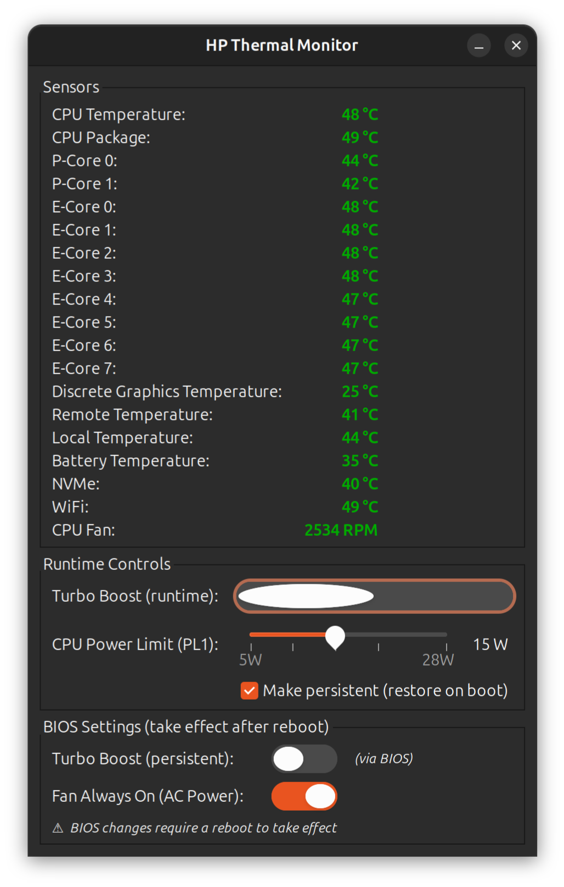

# HP Thermal Control

A GTK system tray applet for thermal and power management on HP ZBook laptops running Linux.


# HP Thermal Control




## Features

- **Live sensor dashboard** — CPU temperature, fan RPM (via `hp_wmi_sensors`)
- **RAPL PL1 power cap** — hard CPU power limit slider (5–28W), with optional boot persistence via `tmpfiles.d`
- **Runtime turbo boost toggle** — instant on/off via `intel_pstate`
- **Persistent turbo boost** — via BIOS attribute (`hp_bioscfg`) or GRUB kernel parameter (`intel_pstate=no_turbo`)
- **Fan Always On (AC)** — BIOS setting via `hp_bioscfg`
- **BIOS password management** — stored securely in GNOME Keyring (Seahorse)

## Why this exists

On **Windows**, HP provides **HP Command Center** for thermal management, and **ThrottleStop** is a popular third-party tool for RAPL power limit control on Intel laptops.

On **Linux**, neither exists. This applet fills that gap — think of it as a **Linux ThrottleStop + HP BIOS settings panel** for HP ZBook laptops.

Standard Linux power daemons (TLP, power-profiles-daemon, auto-cpufreq) do **not** touch RAPL power limits. `powercap-utils` can set PL1 from CLI but has no GUI. This applet is the only Linux GUI with a RAPL slider combined with HP-specific BIOS attribute control.

## Why RAPL?

Direct EC fan speed control is impossible on HP ZBook Firefly G10 — the EC firmware overrides all register writes immediately. RAPL PL1 capping is the most effective solution:

- At 28W default: CPU throttles to ~1.1GHz at 63°C
- At 15W cap: CPU holds ~1.9GHz sustained at 59°C

The firmware's thermal algorithm works *with* you under a hard power cap.

## Requirements

### Hardware
Tested on: HP ZBook Firefly 14 G10 (Intel Core i7-1355U)  
Should work on other HP ZBook / EliteBook models with `hp_bioscfg` and `hp_wmi_sensors` support.

### Software
- Linux kernel 6.x (with `hp_wmi_sensors`, `hp_bioscfg`, `intel_rapl_msr`)
- Python 3.8+
- GTK 3 + AppIndicator3
- libsecret / GNOME Keyring
- polkit + pkexec
- systemd (for tmpfiles.d persistence)

```bash
sudo apt install python3-gi gir1.2-appindicator3-0.1 gir1.2-secret-1 policykit-1
```

## Installation

```bash
git clone https://github.com/tomaskovacik/hp-thermal-control
cd hp-thermal-control
sudo bash install.sh
```

The installer:
1. Checks and loads required kernel modules (`hp_wmi_sensors`, `hp_bioscfg`, `intel_rapl_common`, `intel_rapl_msr`)
2. Installs the privileged helper to `/usr/local/sbin/hp-thermal-helper`
3. Installs the applet to `/usr/local/bin/hp-thermal-applet`
4. Installs the polkit policy
5. Installs the app icon and desktop entry (appears in GNOME launcher)
6. Adds autostart entry for your user

To start immediately after install:
```bash
hp-thermal-applet &
```

## Architecture

```
hp-thermal-applet (GTK3, runs as user)
    └── pkexec hp-thermal-helper (runs as root via polkit)
            ├── turbo          → /sys/devices/system/cpu/intel_pstate/no_turbo
            ├── rapl           → /sys/class/powercap/intel-rapl:0/constraint_0_power_limit_uw
            ├── bios-set       → /sys/class/firmware-attributes/hp-bioscfg/...
            ├── tmpfiles-set   → /etc/tmpfiles.d/hp-thermal.conf
            ├── tmpfiles-unset → removes RAPL entry from tmpfiles.d
            └── grub-turbo     → /etc/default/grub + update-grub
```

## BIOS Settings

BIOS attributes are managed via the `hp_bioscfg` kernel module. Changes take effect after reboot.

The BIOS admin password is required for BIOS attribute changes. It is stored in GNOME Keyring on first successful use.

**Turbo Boost (persistent):** choose between BIOS attribute or GRUB kernel parameter (`intel_pstate=no_turbo`) if you don't know the BIOS password.

## Known Issues

- `hp_bioscfg` may log `kobject attempted to be registered with empty name` on some BIOS versions — this is a firmware bug but the module still works
- BIOS password is consumed on each write (by design in hp_bioscfg)
- `hp_wmi_sensors` hwmon index may vary — the applet detects it dynamically by name

## License

MIT
